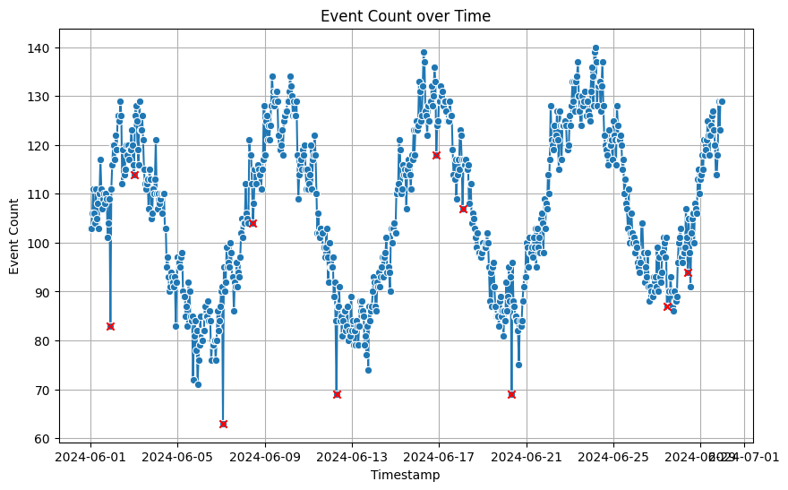

Welcome to the **Anomaly Detection** solution accelerator.

This accelerator provides an introduction to detecting anomalies in Snowplow event data, specifically within **BigQuery** on **Google Cloud Platform (GCP)**. The focus is on identifying anomalies in a **time series dataset**, using event volume data stored in BigQuery. This can help detect potential tracking issues or sudden increases in failed events.

This guide walks you through the steps required to:
- Load Snowplow event data into **BigQuery**
- Train an **ARIMA+** model for time series anomaly detection
- Identify statistically significant drops in event counts
- Visualize anomalies using **matplotlib** and **seaborn**

## Requirements

To use this accelerator, you need:
- **Access to a GCP project** (including the project ID)
- **BigQuery permissions** (read, write, and query access)
- *A Snowplow pipeline is not required*, as sample data is provided.

This accelerator will only take 30 minutes to complete. The notebook requires minimal computational resources with the provided sample dataset. 

## Get Started
This accelerator is available as a Google Colab notebook or in GitHub
- [**Colab Notebook**](https://colab.research.google.com/drive/1TnMzg4PsV-sylY-IeNG8PJTK2xFGvNFL#scrollTo=-5a-WhUQ1-bz)
- [**GitHub Repository**](https://github.com/snowplow-industry-solutions/event-volume-anomaly-detection)

## Next Steps

Once you've completed this accelerator, you can:
- Adapt the model to detect anomalies in your own Snowplow event data
- Fine-tune the confidence threshold to reduce false positives
- Expand into detecting anomalies in other Snowplow event properties

By leveraging Snowplow’s granular event data, you can proactively monitor data quality.

Ready to get started? Jump into the [**Colab notebook**](https://colab.research.google.com/drive/1TnMzg4PsV-sylY-IeNG8PJTK2xFGvNFL#scrollTo=-5a-WhUQ1-bz) and start detecting anomalies!
